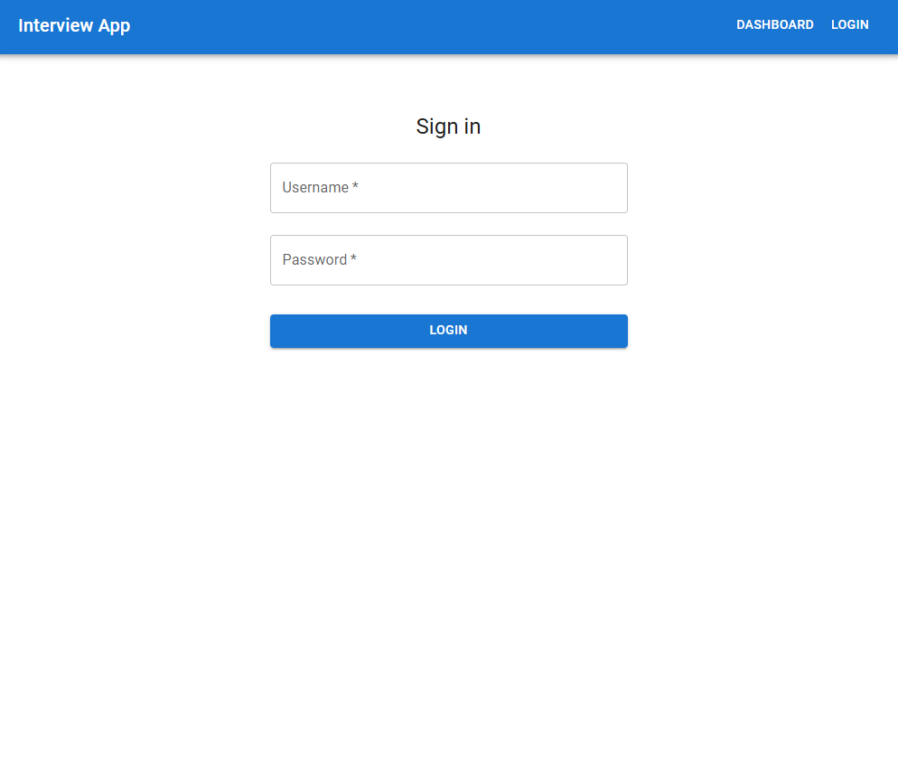
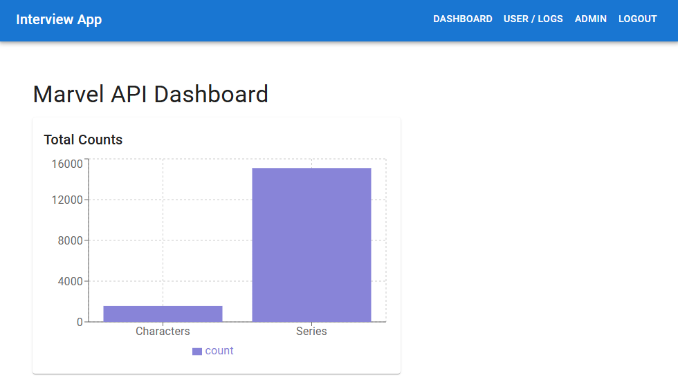
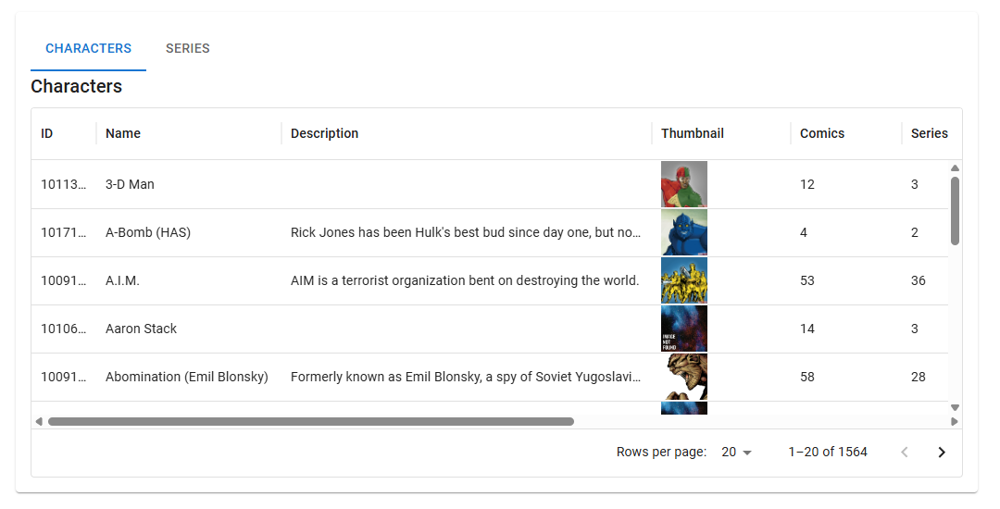
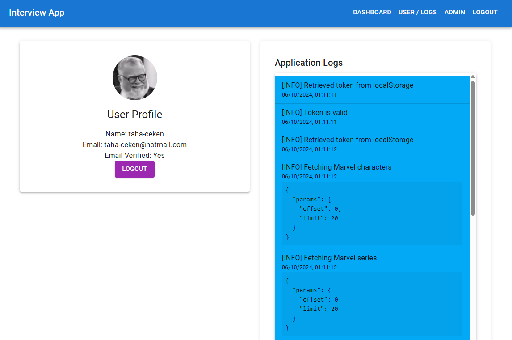

# Interview App

## Purpose
Interview App is designed to demonstrate user management using Auth0 and data presentation from the Marvel API. It follows the 12-factor app principles, ensuring a modular and scalable architecture with clean code practices. The project consists of two main features: user authentication and a dashboard that presents Marvel data.

## Features
- **Auth0 Authentication**: Secure login system with JWT token storage and encryption.
- **Marvel API Integration**: Fetches data such as characters and series from Marvel's public API and displays them in a dashboard.
- **Data Filtering**: Includes pagination, search, and filtering options to manage large datasets.
- **Graphical Statistics**: Shows data statistics and visual representations using charts.

## Installation and Setup

### Prerequisites
- Node.js (v16 or higher)
- NPM or Yarn
- Auth0 Account (for user management)
- Marvel Developer API Key

### Clone the repository
```bash
git clone https://github.com/Tahckn/interview_app.git
cd interview_app

### Install dependencies
```bash
npm install
# or
yarn install
```

### Environment Variables
Create a `.env` file in the root directory with the following variables:
```bash
VITE_AUTH0_DOMAIN=<your-auth0-domain>
VITE_AUTH0_CLIENT_ID=<your-auth0-client-id>
VITE_AUTH0_CLIENT_SECRET=<your-auth0-client-secret>
VITE_AUTH0_AUDIENCE=<your-auth0-audience>
VITE_SECRET_KEY=<your-secret-key-for-jwt>
VITE_MARVEL_API_PUBLIC_KEY=<your-marvel-api-public-key>
VITE_MARVEL_API_PRIVATE_KEY=<your-marvel-api-private-key>
VITE_MARVEL_API_BASE_URL=<your-marvel-api-base-url>
```

### Start the development server
```bash
npm start
# or
yarn start
```
Open `http://localhost:5173` in your browser to access the application.

## Usage Guide


### Authentication
1. Create your user in Auth0
2. Add your local url to the allowed callback URLs, logout URLs, and web origins
3. Add Password Grant Type to your API in Auth0 in Advanced Settings
4. Click on the "Login" button in the top right corner
5. Upon successful login, you'll be redirected to the dashboard

### Data Visualization
1. Navigate to the "Dashboard" tab
2. You will see the total number of characters and series
3. It will update depending on the filters you apply

### Exploring Marvel Data
1. Navigate to the "Dashboard" tab
2. Apply filters to refine your search
3. Use the pagination to navigate through the results

### User Information and Logs
1. Navigate to the "User" tab
2. You will see your user information and logs


## Screenshots






